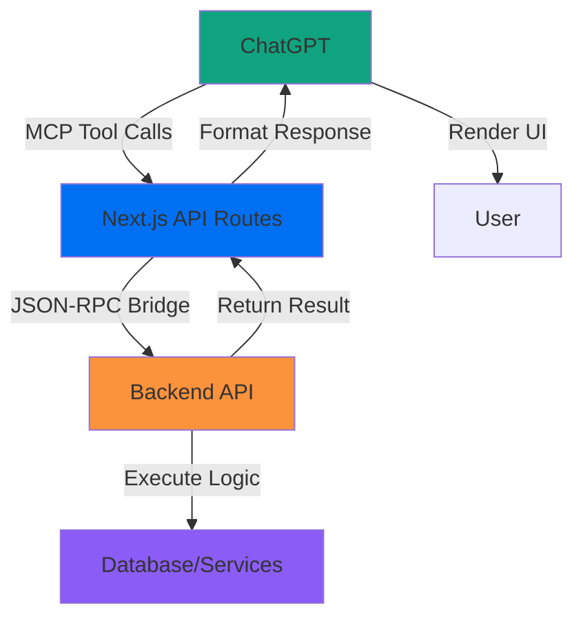
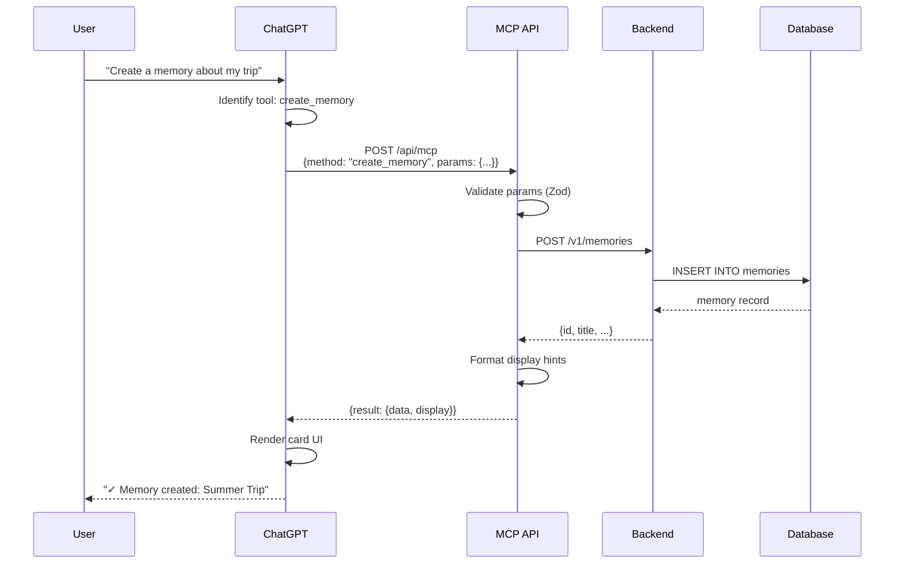

# ChatGPT Apps Build Guide

> Complete guide for building ChatGPT applications using Vercel, Next.js, and the Model Context Protocol (MCP)

## Table of Contents

1. [Overview](#overview)
2. [Architecture](#architecture)
3. [Prerequisites](#prerequisites)
4. [Quick Start](#quick-start)
5. [Project Structure](#project-structure)
6. [Core Components](#core-components)
7. [MCP Integration](#mcp-integration)
8. [Deployment](#deployment)
9. [Best Practices](#best-practices)
10. [Testing](#testing)
11. [Troubleshooting](#troubleshooting)

---

## Overview

ChatGPT apps enable custom UI components and functionality to run **natively inside the OpenAI sandbox**, integrated directly into ChatGPT conversations. Unlike iframe-based approaches, this provides seamless integration with access to modern React patterns and server-side capabilities.

### Key Benefits

- **Native Integration**: Runs directly in OpenAI sandbox (no iframes)
- **Modern Stack**: Full Next.js 14+ with RSC and SSR
- **Vercel Infrastructure**: Preview deployments, instant rollbacks, streamlined CI/CD
- **MCP Protocol**: Standardized tool interface for ChatGPT interaction

---

## Architecture



### Stack Components

1. **ChatGPT** - User interaction layer, tool invocation
2. **Next.js Frontend** - API routes, UI components, MCP bridge
3. **Backend API** - Business logic, data processing (optional for simple apps)
4. **Data Layer** - Database, external services, APIs

### MCP (Model Context Protocol)

MCP is the communication protocol between ChatGPT and your app:

- **Tool Calls**: ChatGPT invokes functions you define
- **JSON-RPC**: Standardized message format
- **Manifest**: Tool schemas and metadata in `chatgpt-mcp-manifest.json`

---

## Prerequisites

### Required

- **Node.js**: ≥18.17 (Next.js 14 requirement)
- **Vercel Account**: Free tier works for development
- **OpenAI Developer Account**: For ChatGPT app registration

### Recommended

- **TypeScript**: Type safety for MCP schemas
- **Git**: Version control and Vercel deployment
- **PostgreSQL**: If you need persistent data (or any database)

### Environment Setup

```bash
# Verify Node version
node --version  # Should be ≥18.17

# Install Vercel CLI
npm i -g vercel

# Login to Vercel
vercel login
```

---

## Quick Start

### 1. Clone Starter Template

```bash
# Using Vercel CLI
vercel init chatgpt-app

# Or manually
git clone https://github.com/vercel/next.js-chatgpt-template
cd next.js-chatgpt-template
npm install
```

### 2. Configure MCP Manifest

Create `chatgpt-mcp-manifest.json` in project root:

```json
{
  "openapi": "3.1.0",
  "info": {
    "title": "My ChatGPT App",
    "version": "1.0.0",
    "description": "App description for ChatGPT"
  },
  "servers": [
    {
      "url": "https://your-app.vercel.app"
    }
  ],
  "paths": {
    "/api/mcp": {
      "post": {
        "operationId": "mcp_handler",
        "summary": "MCP tool handler",
        "requestBody": {
          "content": {
            "application/json": {
              "schema": {
                "$ref": "#/components/schemas/MCPRequest"
              }
            }
          }
        }
      }
    }
  },
  "components": {
    "schemas": {
      "MCPRequest": {
        "type": "object",
        "required": ["jsonrpc", "method", "params"],
        "properties": {
          "jsonrpc": { "type": "string", "enum": ["2.0"] },
          "method": { "type": "string" },
          "params": { "type": "object" },
          "id": { "type": ["string", "number"] }
        }
      }
    }
  }
}
```

### 3. Create MCP Handler

Create `app/api/mcp/route.ts`:

```typescript
import { NextRequest, NextResponse } from 'next/server';

interface MCPRequest {
  jsonrpc: '2.0';
  method: string;
  params: Record<string, any>;
  id?: string | number;
}

export async function POST(request: NextRequest) {
  try {
    const body: MCPRequest = await request.json();

    // Route to appropriate tool handler
    switch (body.method) {
      case 'create_item':
        return handleCreateItem(body.params);
      case 'search_items':
        return handleSearchItems(body.params);
      default:
        return NextResponse.json({
          jsonrpc: '2.0',
          error: {
            code: -32601,
            message: `Method not found: ${body.method}`
          },
          id: body.id
        }, { status: 404 });
    }
  } catch (error) {
    return NextResponse.json({
      jsonrpc: '2.0',
      error: {
        code: -32603,
        message: 'Internal error',
        data: error instanceof Error ? error.message : 'Unknown error'
      }
    }, { status: 500 });
  }
}

async function handleCreateItem(params: any) {
  // Your logic here
  const result = { id: '123', ...params };

  return NextResponse.json({
    jsonrpc: '2.0',
    result: {
      data: result,
      display: {
        type: 'card',
        title: 'Item Created',
        description: `Created item: ${params.name}`
      }
    }
  });
}

async function handleSearchItems(params: any) {
  // Your logic here
  const results = [{ id: '1', name: 'Example' }];

  return NextResponse.json({
    jsonrpc: '2.0',
    result: {
      data: results,
      display: {
        type: 'list',
        items: results.map(r => ({
          title: r.name,
          description: `ID: ${r.id}`
        }))
      }
    }
  });
}
```

### 4. Local Development

```bash
# Start dev server
npm run dev

# Test MCP endpoint
curl -X POST http://localhost:3000/api/mcp \
  -H "Content-Type: application/json" \
  -d '{"jsonrpc":"2.0","method":"create_item","params":{"name":"Test"},"id":1}'
```

### 5. Deploy to Vercel

```bash
# First deployment
vercel

# Production deployment
vercel --prod
```

### 6. Register with ChatGPT

1. Go to [platform.openai.com](https://platform.openai.com)
2. Navigate to "ChatGPT Apps"
3. Click "Create App"
4. Enter your Vercel deployment URL
5. Upload `chatgpt-mcp-manifest.json`
6. Test in ChatGPT

---

## Project Structure

### Recommended Layout

```
my-chatgpt-app/
├── app/
│   ├── api/
│   │   ├── mcp/
│   │   │   └── route.ts          # Main MCP handler
│   │   └── proxy/
│   │       └── [...path]/
│   │           └── route.ts      # Optional: Backend proxy
│   ├── layout.tsx                # Root layout
│   ├── page.tsx                  # Landing page
│   └── globals.css               # Tailwind styles
├── components/
│   └── ui/                       # Reusable UI components
├── lib/
│   ├── mcp/
│   │   ├── types.ts              # MCP type definitions
│   │   ├── tools.ts              # Tool implementations
│   │   └── schemas.ts            # Zod schemas for validation
│   └── utils.ts                  # Utility functions
├── chatgpt-mcp-manifest.json     # MCP tool definitions
├── package.json
├── tsconfig.json
└── vercel.json                   # Vercel configuration
```

### File Purposes

- **`app/api/mcp/route.ts`**: Entry point for all MCP tool calls from ChatGPT
- **`chatgpt-mcp-manifest.json`**: Defines available tools, parameters, schemas
- **`lib/mcp/tools.ts`**: Business logic for each tool
- **`vercel.json`**: Custom headers, rewrites, environment config

---

## Core Components

### 1. MCP Manifest Schema

Define your tools in `chatgpt-mcp-manifest.json`:

```json
{
  "tools": [
    {
      "name": "create_memory",
      "description": "Create a new memory with narrative content",
      "parameters": {
        "type": "object",
        "required": ["title", "narrative"],
        "properties": {
          "title": {
            "type": "string",
            "description": "Brief title for the memory"
          },
          "narrative": {
            "type": "string",
            "description": "Detailed narrative content"
          },
          "tags": {
            "type": "array",
            "items": { "type": "string" },
            "description": "Optional tags for categorization"
          }
        }
      }
    },
    {
      "name": "search_memories",
      "description": "Search through memories using semantic similarity",
      "parameters": {
        "type": "object",
        "required": ["query"],
        "properties": {
          "query": {
            "type": "string",
            "description": "Search query"
          },
          "limit": {
            "type": "integer",
            "minimum": 1,
            "maximum": 50,
            "default": 10,
            "description": "Maximum results to return"
          }
        }
      }
    }
  ]
}
```

### 2. Type-Safe Tool Handlers

Use Zod for runtime validation:

```typescript
// lib/mcp/schemas.ts
import { z } from 'zod';

export const CreateMemorySchema = z.object({
  title: z.string().min(1).max(200),
  narrative: z.string().min(1),
  tags: z.array(z.string()).optional()
});

export const SearchMemoriesSchema = z.object({
  query: z.string().min(1),
  limit: z.number().int().min(1).max(50).default(10)
});

export type CreateMemoryParams = z.infer<typeof CreateMemorySchema>;
export type SearchMemoriesParams = z.infer<typeof SearchMemoriesSchema>;
```

```typescript
// lib/mcp/tools.ts
import { CreateMemoryParams, SearchMemoriesParams } from './schemas';

export async function createMemory(params: CreateMemoryParams) {
  // Validate already done by schema

  // Call backend or database
  const memory = await fetch(`${process.env.BACKEND_API}/memories`, {
    method: 'POST',
    headers: { 'Content-Type': 'application/json' },
    body: JSON.stringify(params)
  }).then(r => r.json());

  return {
    data: memory,
    display: {
      type: 'card',
      title: `Memory Created: ${memory.title}`,
      description: memory.narrative.slice(0, 200),
      metadata: {
        id: memory.id,
        created_at: memory.created_at
      }
    }
  };
}

export async function searchMemories(params: SearchMemoriesParams) {
  const results = await fetch(
    `${process.env.BACKEND_API}/search?q=${encodeURIComponent(params.query)}&limit=${params.limit}`
  ).then(r => r.json());

  return {
    data: results,
    display: {
      type: 'list',
      items: results.map((m: any) => ({
        title: m.title,
        description: m.snippet,
        url: `/memory/${m.id}`
      }))
    }
  };
}
```

### 3. Unified MCP Router

```typescript
// app/api/mcp/route.ts
import { NextRequest, NextResponse } from 'next/server';
import { CreateMemorySchema, SearchMemoriesSchema } from '@/lib/mcp/schemas';
import { createMemory, searchMemories } from '@/lib/mcp/tools';

const TOOL_HANDLERS = {
  create_memory: { schema: CreateMemorySchema, handler: createMemory },
  search_memories: { schema: SearchMemoriesSchema, handler: searchMemories }
};

export async function POST(request: NextRequest) {
  try {
    const { jsonrpc, method, params, id } = await request.json();

    // Validate JSON-RPC
    if (jsonrpc !== '2.0') {
      return errorResponse('Invalid JSON-RPC version', -32600, id);
    }

    // Find tool handler
    const tool = TOOL_HANDLERS[method as keyof typeof TOOL_HANDLERS];
    if (!tool) {
      return errorResponse(`Method not found: ${method}`, -32601, id);
    }

    // Validate params
    const validatedParams = tool.schema.parse(params);

    // Execute tool
    const result = await tool.handler(validatedParams);

    return NextResponse.json({ jsonrpc: '2.0', result, id });
  } catch (error) {
    console.error('MCP handler error:', error);
    return errorResponse(
      error instanceof Error ? error.message : 'Internal error',
      -32603
    );
  }
}

function errorResponse(message: string, code: number, id?: any) {
  return NextResponse.json({
    jsonrpc: '2.0',
    error: { code, message },
    id: id ?? null
  }, { status: code === -32601 ? 404 : 500 });
}
```

---

## MCP Integration

### Tool Invocation Flow



### Display Hints

Guide ChatGPT on how to render results:

```typescript
// Card display
{
  display: {
    type: 'card',
    title: 'Memory Created',
    description: 'Your summer trip has been saved',
    metadata: {
      id: 'mem_123',
      created_at: '2025-10-24T10:00:00Z'
    },
    actions: [
      { label: 'View', url: '/memory/mem_123' },
      { label: 'Edit', url: '/memory/mem_123/edit' }
    ]
  }
}

// List display
{
  display: {
    type: 'list',
    items: [
      {
        title: 'Summer Trip 2024',
        description: 'Barcelona, Paris, Amsterdam...',
        thumbnail: 'https://...',
        url: '/memory/mem_123'
      }
    ],
    total: 42,
    hasMore: true
  }
}

// Table display
{
  display: {
    type: 'table',
    headers: ['Title', 'Date', 'Tags'],
    rows: [
      ['Summer Trip', '2024-06-15', 'travel, europe'],
      ['Conference Notes', '2024-08-20', 'work, tech']
    ]
  }
}

// Rich text
{
  display: {
    type: 'markdown',
    content: '# Results\n\nFound 3 memories...'
  }
}
```

### Authentication

Pass user context via JWT tokens:

```typescript
// app/api/mcp/route.ts
import { auth } from '@clerk/nextjs';  // or your auth provider

export async function POST(request: NextRequest) {
  // Get authenticated user
  const { userId } = auth();
  if (!userId) {
    return errorResponse('Unauthorized', -32000);
  }

  const { method, params } = await request.json();

  // Pass userId to backend
  const result = await fetch(`${process.env.BACKEND_API}/v1/${method}`, {
    method: 'POST',
    headers: {
      'Content-Type': 'application/json',
      'Authorization': `Bearer ${await getToken()}`
    },
    body: JSON.stringify({ ...params, user_id: userId })
  });

  // ...
}
```

---

## Deployment

### Vercel Configuration

Create `vercel.json`:

```json
{
  "buildCommand": "npm run build",
  "devCommand": "npm run dev",
  "installCommand": "npm install",
  "framework": "nextjs",
  "regions": ["iad1"],
  "env": {
    "BACKEND_API": "@backend-api-url",
    "DATABASE_URL": "@database-url"
  },
  "headers": [
    {
      "source": "/api/mcp",
      "headers": [
        {
          "key": "Access-Control-Allow-Origin",
          "value": "https://chatgpt.com"
        },
        {
          "key": "Access-Control-Allow-Methods",
          "value": "POST, OPTIONS"
        }
      ]
    }
  ]
}
```

### Environment Variables

Set in Vercel dashboard or CLI:

```bash
# Production
vercel env add BACKEND_API production
vercel env add DATABASE_URL production

# Preview
vercel env add BACKEND_API preview
vercel env add DATABASE_URL preview

# Development
vercel env add BACKEND_API development
vercel env add DATABASE_URL development
```

### Deployment Workflow

```bash
# Preview deployment (auto-deploy on PR)
git push origin feature-branch

# Production deployment
git push origin main  # Auto-deploys if connected to Vercel

# Manual deployment
vercel --prod
```

### Domain Setup

1. Go to Vercel project settings
2. Add custom domain
3. Update DNS records
4. Update `chatgpt-mcp-manifest.json` with new domain
5. Re-register with ChatGPT

---

## Best Practices

### 1. Error Handling

```typescript
// Structured error responses
function mcpError(message: string, code: number, data?: any) {
  return {
    jsonrpc: '2.0',
    error: {
      code,
      message,
      data
    }
  };
}

// Standard error codes
const MCP_ERRORS = {
  PARSE_ERROR: -32700,
  INVALID_REQUEST: -32600,
  METHOD_NOT_FOUND: -32601,
  INVALID_PARAMS: -32602,
  INTERNAL_ERROR: -32603,
  UNAUTHORIZED: -32000,
  FORBIDDEN: -32001,
  NOT_FOUND: -32002,
  RATE_LIMIT: -32003
};
```

### 2. Rate Limiting

```typescript
// app/api/mcp/route.ts
import { Ratelimit } from '@upstash/ratelimit';
import { Redis } from '@upstash/redis';

const ratelimit = new Ratelimit({
  redis: Redis.fromEnv(),
  limiter: Ratelimit.slidingWindow(10, '10 s'),
  analytics: true
});

export async function POST(request: NextRequest) {
  const userId = getUserId(request);
  const { success } = await ratelimit.limit(userId);

  if (!success) {
    return errorResponse('Rate limit exceeded', -32003);
  }

  // ... continue
}
```

### 3. Logging & Monitoring

```typescript
// lib/logger.ts
import { Logger } from '@vercel/analytics';

export function logMCPCall(method: string, params: any, duration: number) {
  Logger.track('mcp_tool_call', {
    method,
    params_keys: Object.keys(params),
    duration_ms: duration,
    timestamp: new Date().toISOString()
  });
}

// In handler
const start = Date.now();
const result = await tool.handler(params);
logMCPCall(method, params, Date.now() - start);
```

### 4. Caching

```typescript
import { unstable_cache } from 'next/cache';

export const getMemories = unstable_cache(
  async (userId: string) => {
    return await fetch(`${API}/memories?user_id=${userId}`).then(r => r.json());
  },
  ['user-memories'],
  { revalidate: 60 }  // Cache for 60 seconds
);
```

### 5. Schema Versioning

```typescript
// Support multiple API versions
const SCHEMAS_V1 = { /* ... */ };
const SCHEMAS_V2 = { /* ... */ };

function getSchema(method: string, version: string = 'v1') {
  const schemas = version === 'v2' ? SCHEMAS_V2 : SCHEMAS_V1;
  return schemas[method];
}
```

---

## Testing

### Unit Tests

```typescript
// __tests__/mcp/tools.test.ts
import { createMemory } from '@/lib/mcp/tools';

describe('createMemory', () => {
  it('creates a memory with valid params', async () => {
    const result = await createMemory({
      title: 'Test Memory',
      narrative: 'This is a test'
    });

    expect(result.data).toHaveProperty('id');
    expect(result.display.type).toBe('card');
  });

  it('throws on invalid params', async () => {
    await expect(createMemory({ title: '' })).rejects.toThrow();
  });
});
```

### Integration Tests

```typescript
// __tests__/api/mcp.test.ts
import { POST } from '@/app/api/mcp/route';
import { NextRequest } from 'next/server';

describe('MCP API', () => {
  it('handles create_memory tool call', async () => {
    const request = new NextRequest('http://localhost:3000/api/mcp', {
      method: 'POST',
      body: JSON.stringify({
        jsonrpc: '2.0',
        method: 'create_memory',
        params: { title: 'Test', narrative: 'Content' },
        id: 1
      })
    });

    const response = await POST(request);
    const data = await response.json();

    expect(data.jsonrpc).toBe('2.0');
    expect(data.result).toBeDefined();
    expect(data.id).toBe(1);
  });
});
```

### E2E Testing with ChatGPT

```bash
# Use OpenAI API to test tool invocations
curl https://api.openai.com/v1/chat/completions \
  -H "Authorization: Bearer $OPENAI_API_KEY" \
  -H "Content-Type: application/json" \
  -d '{
    "model": "gpt-4",
    "messages": [{"role": "user", "content": "Create a memory about testing"}],
    "tools": [/* your tool definitions */]
  }'
```

---

## Troubleshooting

### Common Issues

**1. "Method not found" errors**
- Verify method name matches manifest exactly
- Check `TOOL_HANDLERS` includes the method
- Ensure manifest is uploaded to ChatGPT

**2. CORS errors**
- Add ChatGPT origin to allowed origins in `vercel.json`
- Check API route returns proper CORS headers

**3. Authentication failures**
- Verify JWT token is passed correctly
- Check token expiration and refresh logic
- Ensure backend validates tokens properly

**4. Slow responses**
- Add caching for expensive operations
- Use streaming responses for long-running tasks
- Optimize database queries

**5. Rate limiting issues**
- Implement per-user rate limits
- Use Redis for distributed rate limiting
- Return proper error codes (-32003)

### Debugging

```typescript
// Enable verbose logging
export async function POST(request: NextRequest) {
  const body = await request.json();
  console.log('[MCP] Incoming request:', JSON.stringify(body, null, 2));

  try {
    const result = await handleRequest(body);
    console.log('[MCP] Response:', JSON.stringify(result, null, 2));
    return NextResponse.json(result);
  } catch (error) {
    console.error('[MCP] Error:', error);
    throw error;
  }
}
```

### Vercel Logs

```bash
# View deployment logs
vercel logs <deployment-url>

# Stream live logs
vercel logs --follow

# Filter by function
vercel logs --function=api/mcp
```

---

## Examples

### Weave Memory Platform (Reference Implementation)

See this repository for a complete example:

```
weave/
├── apps/chatgpt-ui/
│   ├── app/api/mcp/route.ts      # MCP handler
│   └── middleware.ts              # Auth middleware
├── chatgpt-mcp-manifest.json      # Tool definitions
└── services/api/                  # Backend FastAPI
```

**Key files to review:**
- `apps/chatgpt-ui/app/api/mcp/route.ts` - MCP routing
- `chatgpt-mcp-manifest.json` - Tool schemas
- `services/api/app/routers/*.py` - Backend handlers

---

## Resources

### Documentation
- [Vercel ChatGPT Apps](https://vercel.com/changelog/chatgpt-apps-support-on-vercel)
- [Next.js Documentation](https://nextjs.org/docs)
- [OpenAI Platform Docs](https://platform.openai.com/docs)
- [Model Context Protocol Spec](https://spec.modelcontextprotocol.io/)

### Tools & Libraries
- [mcp-handler](https://www.npmjs.com/package/mcp-handler) - MCP utilities
- [Zod](https://zod.dev/) - Schema validation
- [Vercel CLI](https://vercel.com/docs/cli) - Deployment tool

### Templates
- [Next.js ChatGPT Template](https://vercel.com/templates/next.js/chatgpt-app)
- [Weave Memory Platform](https://github.com/yourusername/weave) - Full example

---

## Checklist

Before deploying your ChatGPT app:

- [ ] `chatgpt-mcp-manifest.json` is valid and complete
- [ ] All tool handlers have proper error handling
- [ ] Authentication is implemented and tested
- [ ] Rate limiting is configured
- [ ] CORS headers are set correctly
- [ ] Environment variables are configured in Vercel
- [ ] Display hints are comprehensive
- [ ] Logging and monitoring are set up
- [ ] Unit and integration tests pass
- [ ] Manual testing in ChatGPT completed
- [ ] Documentation is up to date

---

## Next Steps

1. **Start with template**: Use Vercel's ChatGPT app template
2. **Define tools**: Create `chatgpt-mcp-manifest.json` with your tools
3. **Implement handlers**: Build tool logic in `app/api/mcp/route.ts`
4. **Test locally**: Verify with curl and unit tests
5. **Deploy**: Push to Vercel for preview deployment
6. **Register**: Add app to ChatGPT platform
7. **Iterate**: Test in ChatGPT and refine based on usage

---

*Last updated: 2025-10-24*
